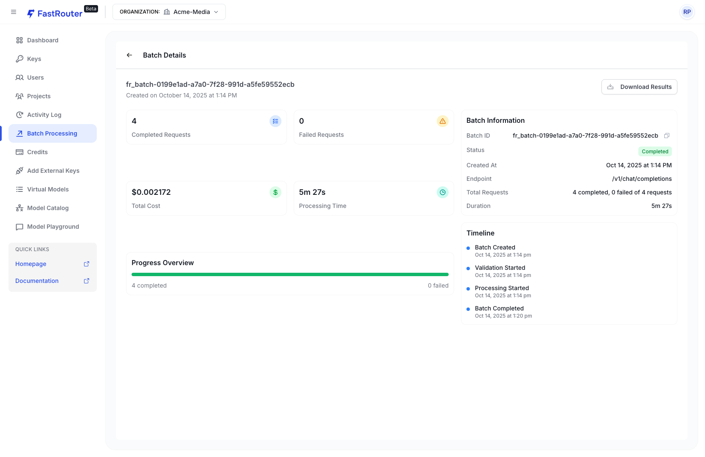

# Batch Processing

## Overview

Batch processing allows you to upload a JSONL file containing a series of chat completion or embedding requests, which are processed asynchronously across supported providers (currently OpenAI, Anthropic and Gemini). More providers will be added soon.

Batch processing is ideal for high-volume tasks, such as generating embeddings for large datasets or running multiple chat completions in parallel. Requests are processed within 24 hours (often much quicker), and results are made available as a downloadable file. Each batch uses the specified FastRouter API key for billing.

**Key Benefits:**

* Asynchronous execution to avoid rate limits and enable bulk operations.
* Mix of models from supported providers within a single batch file.
* Unified endpoint per file (e.g., all chat completions or all embeddings).



***

### **Supported Endpoints and Providers**

* **Endpoints:** `/v1/chat/completions` (for chat-completion requests) and `/v1/embeddings` (for generating vector representations).
* **Providers:** OpenAI, Anthropic and Gemini. All requests in a batch file must use the same endpoint, but you can mix models from these providers (e.g., combine OpenAI's GPT models with Anthropic's Claude models and Google's Gemini models in a chat completions batch).

For batch pricing details, please refer to the individual model pages for [OpenAI and Anthropic models](https://fastrouter.ai/models?creator=OpenAI%252CAnthropic\&order=newest).

***

### **File Format**

Batch files must be in JSONL format (one JSON object per line). Each line represents a single request and must include:

* **`custom_id`**: A unique string identifier for the request (e.g., "request-1"). This must be unique across the file.
* **`provider`**: The provider slug (e.g., "openai" or "anthropic").
* **`method`**: Always "POST".
* **`url`**: The endpoint, either "/v1/chat/completions" or "/v1/embeddings". All lines in the file must use the same URL.
* **`body`**: The request payload, including "model" and other parameters specific to the endpoint (e.g., "messages" for chat completions, "input" for embeddings).

**Important Notes:**

* Ensure all custom\_ids are unique to avoid processing errors.
* The file can mix models from supported providers, but the endpoint must be consistent.
* Maximum file size and request limits may apply; check your account dashboard for details.

#### **Example: Chat Completions Batch File**

This JSONL file mixes OpenAI and Anthropic models for chat completions:

```
{"custom_id": "request-1", "provider": "anthropic", "method": "POST", "url": "/v1/chat/completions", "body": {"model": "anthropic/claude-4.5-sonnet", "messages": [{"role": "user", "content": "Hello world! what is 13 + 25"}],"max_tokens": 1000}}
{"custom_id": "request-2", "provider": "anthropic", "method": "POST", "url": "/v1/chat/completions", "body": {"model": "anthropic/claude-4.5-sonnet", "messages": [{"role": "user", "content": "Hello world! what comes next in series 2 ,4, 6, 8, 10, "}],"max_tokens": 1000}}
{"custom_id": "request-3", "provider": "openai", "method": "POST", "url": "/v1/chat/completions", "body": {"model": "openai/gpt-4.1-nano", "messages": [{"role": "system", "content": "You are a helpful assistant."},{"role": "user", "content": "Hello world! what is 13 + 25"}],"max_tokens": 1000}}
{"custom_id": "request-4", "provider": "openai", "method": "POST", "url": "/v1/chat/completions", "body": {"model": "openai/gpt-4.1", "messages": [{"role": "system", "content": "You are an unhelpful assistant."},{"role": "user", "content": "Hello world! what comes next in series 2 ,4, 6, 8, 10, "}],"max_tokens": 1000}}
```

#### **Example: Embeddings Batch File**

This JSONL file uses OpenAI models for embeddings:

```
{"custom_id": "request-1", "provider": "openai", "method": "POST", "url": "/v1/embeddings", "body": {"model": "openai/text-embedding-3-large","input": "Meditation cultivates a profound sense of calm and clarity by training the mind to focus on the present moment, helping to reduce stress and anxiety. Regular practice has been shown to improve concentration and mental resilience, making it easier to navigate daily challenges with patience and equanimity. Physiologically, meditation can lower blood pressure and regulate the body’s stress response, promoting better sleep quality and overall health. By fostering greater self-awareness, it encourages more mindful decision-making and emotional balance, strengthening interpersonal relationships and enhancing one’s capacity for compassion. Over time, these combined benefits contribute to a deeper sense of well-being and life satisfaction."}}
{"custom_id": "request-2", "provider": "openai", "method": "POST", "url": "/v1/embeddings", "body": {"model": "openai/text-embedding-3-small","input": "Hi HELLO THERE, EMBED THIS"}}
```

***

### **Creating a Batch Request**

To initiate a batch:

<figure><figcaption></figcaption></figure>

1. **Prepare Your File:** Create a JSONL file following the format above. You can download sample templates from the FastRouter dashboard.
2. **Access the Dashboard:** Log in to your FastRouter account and navigate to the Batch Processing section.
3. **Upload and Configure:**
   * Click "Create Batch."
   * Upload your JSONL file based on the endpoint type.
   * Select an API key from your account (this key will be used for all requests in the batch).
4. **Submit the Batch:** Click "Create" to start processing. Batches are processed asynchronously, and you can monitor progress in the dashboard.

***

### **Monitoring and Retrieving Results**

<figure><figcaption></figcaption></figure>

* **Batch Status:** View your batches in the dashboard under "Batch Jobs." Statuses include In Progress, Completed, or Failed. A progress bar shows completion percentage.
* **Download Results:** Once completed (typically within hours, up to 24 hours), download the output file. The results file is in JSONL format, with each line corresponding to a request by custom\_id, including the response data or any errors.
* **Error Handling:** Check the dashboard for more details of failed requests.

***

### **Pricing and Limits**

* **Cost:** Batch requests are billed based on the batch pricing for the underlying model (e.g., tokens for chat completions, inputs for embeddings).&#x20;
* **Limits:** Batches can contain up to 50,000 requests. Processing time scales with batch size.
* **Best Practices:** Start with small batches to test. Ensure your API key has sufficient credits.
