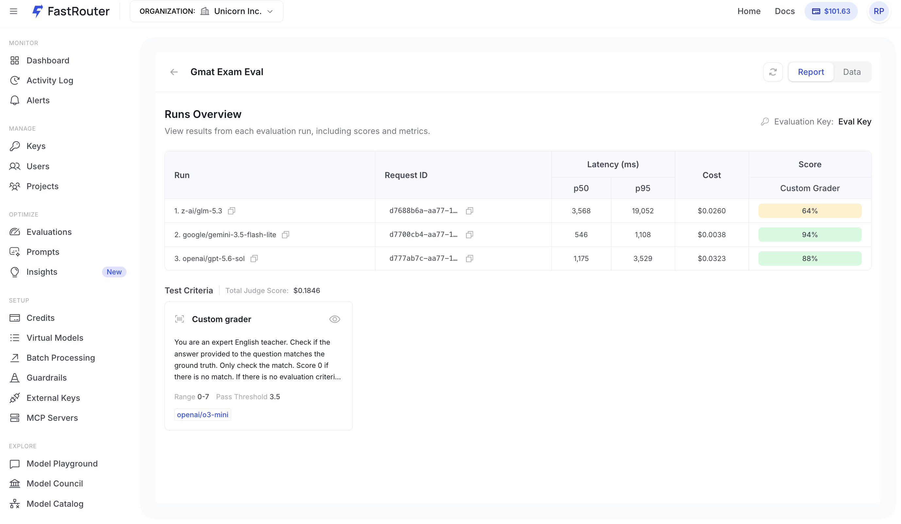

# Dataset Evaluations

## **Introduction**

You bring a JSONL file of inputs: questions, prompts, documents, and (optionally) known-correct answers; and FastRouter generates fresh responses from each model you select, grades them, and reports accuracy, latency, and cost side by side.

Dataset Evals use the same Custom Evaluations infrastructure as image and video evals; the same judge configuration, the same scoring rubrics, and the same results dashboard. The difference is the data source: instead of importing generation logs, you supply the test cases yourself, and the models produce their answers during the run.

***

## **Why Dataset Evaluations?**

Log-based evals tell you how a model behaved on traffic that already happened. Dataset evals let you ask a question you can't answer from logs: _how would a different model have handled this?_

* **Compare models before you switch.** Run the same test cases through multiple candidate models in one go and see accuracy, p50/p95 latency, and cost per run in a single table. This is the fastest way to justify a routing or migration decision with numbers rather than vibes.
* **Score against ground truth.** When your dataset carries a known-correct answer, the judge can check the model's response against it instead of making a subjective quality call. That turns a fuzzy "is this good?" into a measurable pass rate.
* **Build a regression suite.** A saved dataset is a repeatable benchmark. Re-run it whenever a provider ships a new model version, you change a system prompt, or you tune routing rules, and compare against your previous run.
* **Cover cases your logs don't have.** Edge cases, adversarial inputs, compliance scenarios, and rare intents rarely show up in production traffic in useful volume. A curated dataset lets you test them deliberately.
* **Separate prompt quality from model quality.** Because the generation prompt is configured once and applied to every model, differences in the results come from the models, not from inconsistent prompting.
* **Know the cost of the accuracy.** The report puts score next to cost and latency, so you can see when a cheaper model is close enough; the difference between a 94% model at $0.0038 and an 88% model at $0.0323 is a real budget decision.

***

## **Preparing Your Dataset**

Datasets are uploaded as **JSONL**. Each row is one test case, and each field in the row becomes a variable you can reference in prompts.

A row from a multiple-choice dataset looks like this:

```json
{"question": "A variety of options__(A) is__(B) are__(C) was__(D) has been__(E) is being__ available to customers.", "options": ["A) is", "B) are", "C) was", "D) has been", "E) is being"], "answer": "B"}
```

That row exposes `{{item.question}}`, `{{item.options}}`, and `{{item.answer}}` to your prompts, alongside `{{item._line}}` (the row number, added automatically). The `answer` field is your ground truth — the judge uses it to decide whether the model got the row right.

> ℹ️ Not sure about the format? Use **Download Sample** in the Import Test Data dialog to get a correctly structured example file.

***

## **Creating a Dataset Evaluation**

Navigate to the **Evaluations** section in your FastRouter dashboard and click **Create Evaluation**.

**Step 1 — Name Your Evaluation**

Provide a descriptive name (e.g. `GMAT Exam Eval` or `Support-Intent-Classification-v3`).

<figure><figcaption><p>New Evaluation</p></figcaption></figure>

**Step 2 — Upload Your Dataset**

Click **Import Data**. In the Import Test Data dialog, stay on the **Files** tab. Click **Upload File** to add a new JSONL or CSV file, or select a file you have uploaded previously. The dialog shows a **Total rows** count for the selected file.

<figure><figcaption><p>Import Test Data — Files tab</p></figcaption></figure>

Click **Import**. The dataset appears under **Dataset** as _Imported from file_, and the **Data (preview)** panel on the right shows your rows with one column per detected variable. Check this preview before going further — it is the quickest way to catch a malformed file or a mis-parsed column.

<figure><figcaption><p>Data preview after import</p></figcaption></figure>

**Step 3 — Add Models to Compare**

Under **Models to Compare**, click **Add Models**. Filter the catalog by category, context length, input pricing, or creator, then select the models you want to test. You can pick several at once — each becomes its own run in the results.

<figure><figcaption><p>Selecting models to compare</p></figcaption></figure>

**Step 4 — Configure the Generation Prompt**

In the **Configure Message for Output** section, define the System and User messages that will be sent to every selected model. Use `{{curly braces}}` to interpolate dataset fields — this is what turns each row into a request.

<figure><figcaption><p>Configuring the generation prompt</p></figcaption></figure>

Example:

* **System**: `You are a helpful AI Assistant.`
* **User**: `Answer the question in {{item.question}} by choosing one of the options in {{item.options}}. Your answer should contain only an option from the set of options above.`

Constrain the output format here. A judge that has to interpret a paragraph of reasoning to find the model's actual answer will be noisier than one handed a clean single option. Use **Add message** if your task needs a multi-turn setup, then click **Save**.

> ⚠️ Don't reference `{{item.answer}}` in the generation prompt; that hands the model the ground truth and every run will score perfectly. Ground truth belongs in the judge prompt only.

**Step 5 — Add Evaluation Metrics**

Click **Add Metric**. FastRouter offers two families of testing criteria:

<figure><figcaption><p>Add Testing Criteria</p></figcaption></figure>

* **Model Scorer** — uses a model to produce a numeric score within a range you define. Available as **Auto grader** (ready-made rubric) or **Custom grader** (your own prompt).
* **Model Labeler** — uses a model to classify each row and decide which items pass. Available as **Criteria match** or **Custom labeler**.

For ground-truth checking, choose **Model Scorer → Custom grader** and configure it:

<figure><figcaption><p>Custom grader with ground-truth checking</p></figcaption></figure>

* **Model** _(required)_: The judge model (e.g. `openai/o3-mini`).
*   **System**: The judge's instructions. For a ground-truth check, keep it narrow:

    ```
    You are an expert English teacher. Check if the answer provided to the question
    matches the ground truth. Only check the match. Score 0 if there is no match.
    ```
*   **User** _(required)_: The judge's prompt template, built from variables:

    ```
    *Question*
    {{item.question}}

    *Response to evaluate*
    {{sample.output}}

    *Ground Truth*
    {{item.answer}}
    ```
* **Variables**: `{{sample.output}}` is the model's generated response. `{{item.input}}`, `{{item._line}}`, and every field from your dataset (`{{item.question}}`, `{{item.options}}`, `{{item.answer}}`) are also available. The valid list is shown under each prompt box.
* **Range** and **Pass Threshold**: Define the numeric scale (e.g. `0–7`) and the score at which a row counts as a pass (e.g. `3.5`).

**Step 6 — Select Evaluation API Key**

Choose an API key from your account. This key is used both for generating the model responses and for the judge calls.

**Step 7 — Run**

With a dataset, at least one model, a metric, and a key in place, the **Run** button becomes active. Click it to start the evaluation.

FastRouter generates responses for every row against every selected model, then applies the judge to each response. Because a dataset eval makes `rows × models` generation calls plus the same number of judge calls, review the credit estimate before proceeding on large datasets.

***

## **Viewing Results**

Access results from the **Evaluations** listing page by clicking your evaluation. Use the **Report** / **Data** toggle in the top right to switch views.

**Report view** — One row per model run, with Request ID, p50 and p95 latency, cost, and the grader score as a pass percentage. The **Test Criteria** panel below shows the judge prompt, its range and pass threshold, the judge model, and the total judge spend for the evaluation.

<figure><figcaption><p>Report Details</p></figcaption></figure>

**Data view** — One row per test case, showing the input alongside each model's generated output, its score, latency, and cost. Click the expand arrow to open **Content Preview**, which pairs the full input with the generated output and the grader verdict. Use the model selector at the bottom to move between runs, and the arrows to page through rows.

<figure><figcaption><p>Content Preview</p></figcaption></figure>

**Judge Reasoning** — Click the score to open **Criteria Results** and see the judge's step-by-step reasoning for that row, along with the grader configuration that produced it. This is where you confirm the judge is failing rows for the right reason.

<figure><figcaption><p>Judge Feedback</p></figcaption></figure>

**Example output for a 50-row multiple-choice dataset:**

| Run                            | p50 Latency | p95 Latency | Cost    | Custom Grader |
| ------------------------------ | ----------- | ----------- | ------- | ------------- |
| `z-ai/glm-5.3`                 | 3,568 ms    | 19,052 ms   | $0.0260 | 64%           |
| `google/gemini-3.5-flash-lite` | 546 ms      | 1,108 ms    | $0.0038 | 94%           |
| `openai/gpt-5.6-sol`           | 1,175 ms    | 3,529 ms    | $0.0323 | 88%           |

Total judge score cost for the evaluation: $0.1846.

Example judge reasoning for a failed row:

1. The candidate answer provided option A, 'is'.
2. According to the ground truth, the correct answer is option B, 'are'.
3. The candidate answer does not match the ground truth — final score is 0.

***

**Tips & Best Practices**

* **Validate on a small file first**: Run 10–20 rows end to end before uploading hundreds. It's much cheaper to discover a broken prompt variable on 10 rows than on 500.
* **Keep the generation prompt identical across models**: It is configured once for all selected models, which is what makes the comparison fair. Resist the urge to hand-tune per model unless per-model prompting is exactly what you're testing.
* **Constrain the output format**: Ask for just the answer, just the label, or just the JSON. Cleaner outputs mean more reliable grading.
* **Keep the judge prompt narrow**: "Only check the match. Score 0 if there is no match" produces far more consistent results than an open-ended quality instruction when you have ground truth.
* **Use a reasoning model as judge**: Structured graders like `o3-mini` handle multi-step comparisons more reliably than fast chat models.
* **Read a few judge reasonings before trusting the score**: A low pass rate sometimes means a strict or misconfigured judge rather than a weak model. The Criteria Results panel tells you which.
* **Watch p95, not just p50**: A model can look fast on median latency and still have a long tail that hurts production. The report surfaces both.
* **Re-run the same dataset over time**: Keeping the file fixed is what makes runs comparable across model versions and prompt changes.

***

## **Relationship to Custom Evaluations**

Dataset Evals are the core of FastRouter's [Custom Evaluations](custom-evaluations.md) feature. The same infrastructure — dataset management, run comparison, judge configuration, and results dashboard — applies across dataset, chat completion, image, and video evaluations. The key difference is the data source: dataset evals use a JSONL file you upload via the **Files** tab, and responses are generated during the run rather than imported from existing logs.

All judge configuration options (scoring rubrics, variable interpolation, multi-criteria graders, pass thresholds) are shared across every evaluation type.
