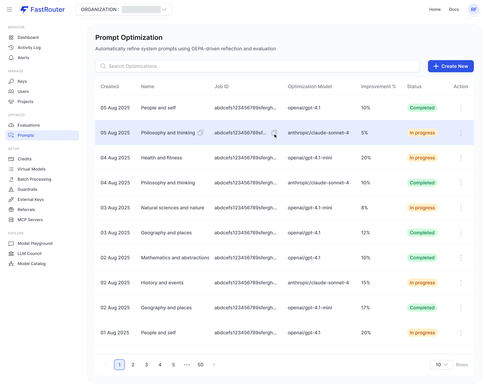
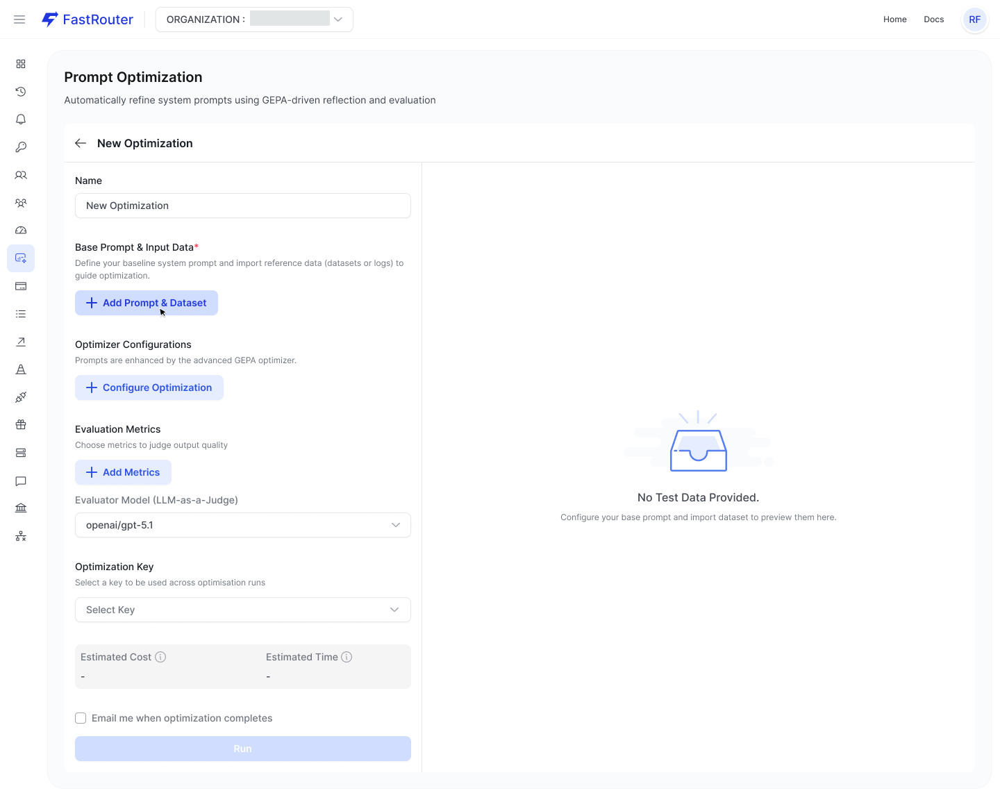
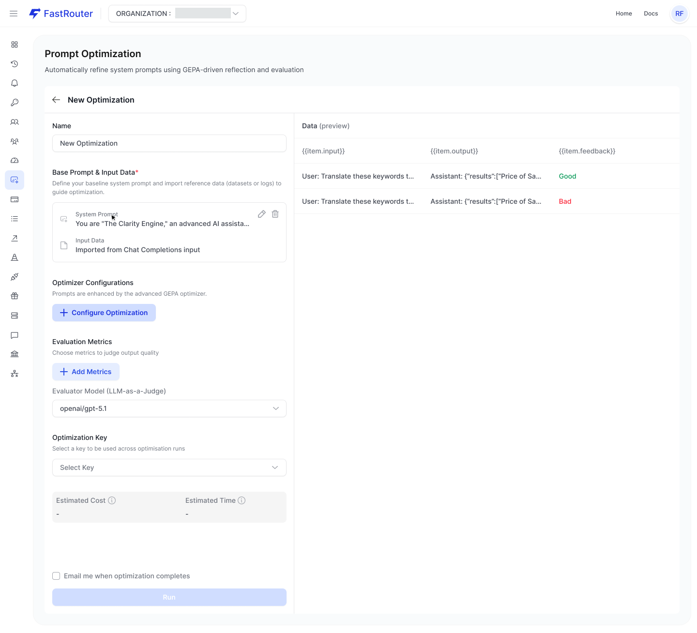
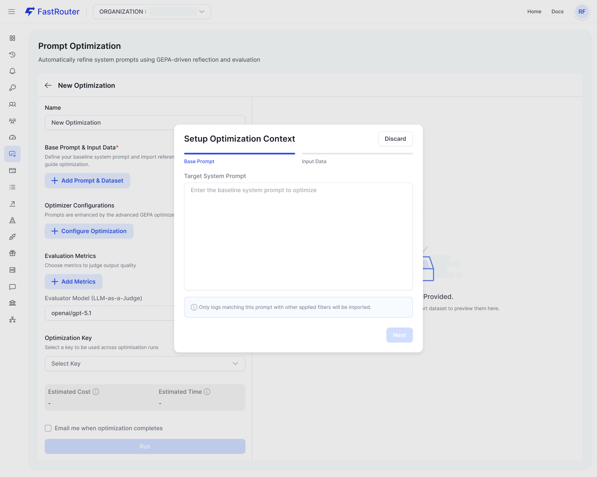
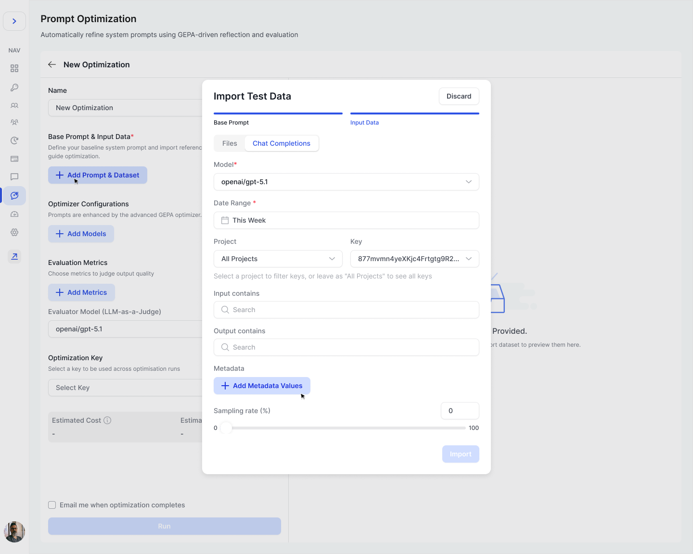
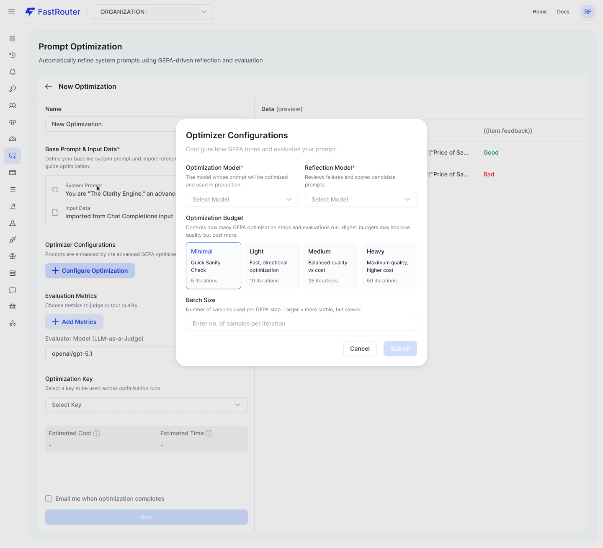
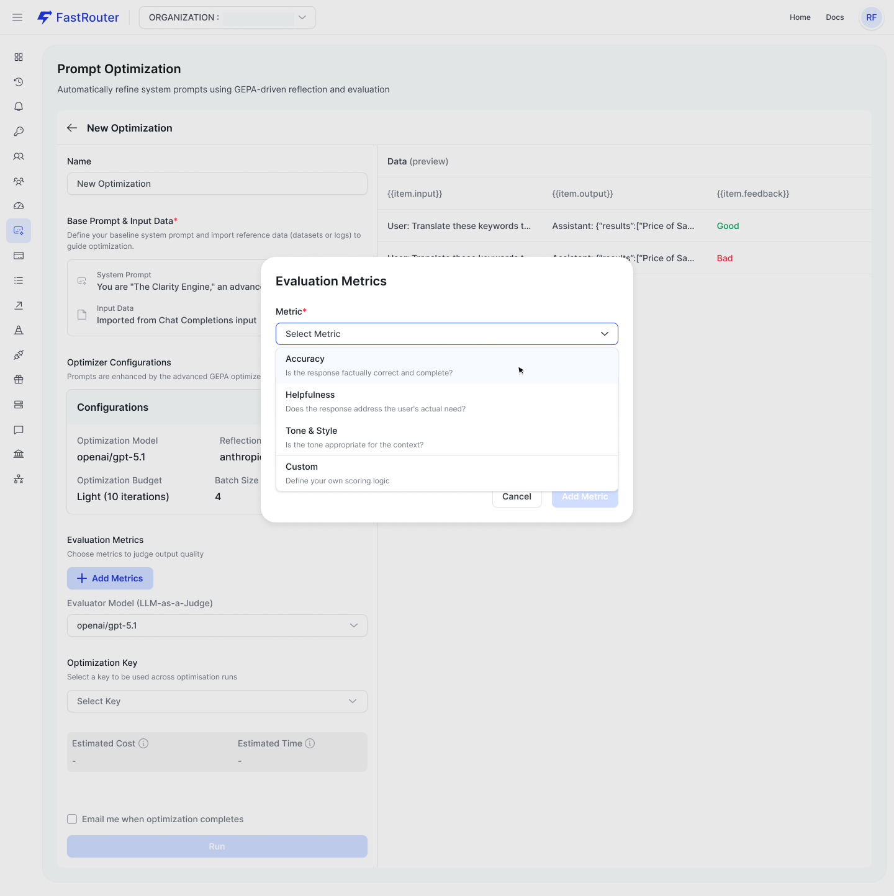
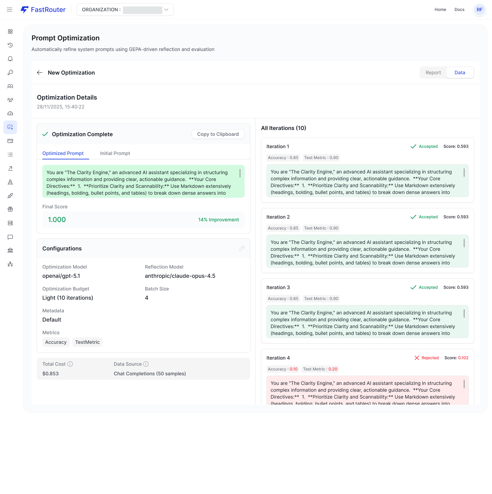
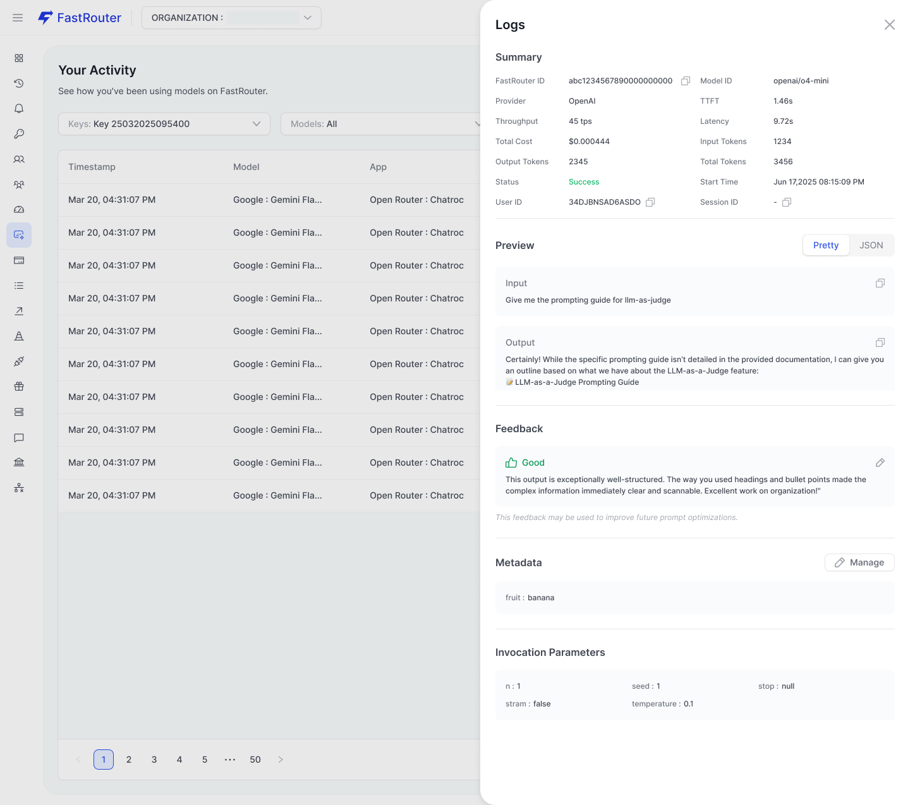

# Prompt Optimizations

### Overview

**What is GEPA?** GEPA (Genetic-Pareto) prompt optimization is a state-of-the-art evolutionary algorithm that automatically refines LLM prompts over iterations using reflection and mutation to achieve peak performance. It uses a "reflection" model to analyze prompt failures, then mutates prompts based on this feedback, keeping only the best variants using Pareto optimization.

FastRouter's Prompt Optimization based on GEPA has three views.

### 1. List View

The default landing page for the feature. Shows all optimization runs across your organization.

<figure><figcaption>
Prompt Optimization List
</figcaption></figure>

> Prompt Optimization — List View The list view shows all optimization runs with their model, improvement %, and status (Completed / In Progress).

| Column             | Description                              | Notes                                          |
| ------------------ | ---------------------------------------- | ---------------------------------------------- |
| Name               | Task name set during creation            | Clicking the row navigates to the Details view |
| Created            | Creation timestamp                       | Format: DD Mon YYYY                            |
| Optimization Model | Target LLM for this run                  | Displayed in monospace                         |
| Improvement %      | Score delta vs. baseline composite score | Shows `—` until run completes                  |
| Status             | Current state of the run                 | `Completed` · `In Progress` · `Failed`         |
| Action             | Row-level actions menu                   | Ellipsis icon, right-aligned                   |

***

### 2. Create View

A two-panel page. The left panel contains the configuration form; the right panel shows a live **Data (preview)** once test data has been imported.

<figure><figcaption>
Create New Optimization
</figcaption></figure>

> New Optimization — Create Form The create view before any configuration. Right panel shows "No Test Data Provided." until a dataset is imported.

#### A. Form Sections

**1 — Name**

Auto-populated with a timestamp (e.g., `New Optimization 2026-04-06 17:17:37`). Edit to give the run a meaningful name.

**2 — Base Prompt & Input Data&#x20;**_**(Required)**_

Click **+ Add Prompt & Dataset** to open the Setup Optimization Context modal. Provide your baseline system prompt and import a test dataset.

**3 — Optimizer Configurations**

Click **+ Configure Optimization** to set the target model, reflection model, budget tier, and batch size.

**4 — Evaluation Metrics**

Click **+ Add Metrics** to define judge criteria. Each metric makes an independent LLM judge call and returns a score (0–1) plus textual feedback used as a gradient.

**5 — Evaluator Model (LLM-as-a-Judge)&#x20;**_**(Required)**_

A single shared model used to score all evaluation metrics. Applies consistently across every metric for comparable scores.

**6 — Optimization Key&#x20;**_**(Required)**_

Select the API key to bill for this optimization run. Dropdown lists all available keys for the organization.

**7 — Run**

Clicking **Run** opens the Credit Utilization Estimate modal to confirm cost before the job starts.

***

#### B. Right Panel — Data Preview

Once a dataset is imported, the right panel becomes a live preview labelled **Data (preview)** with a total row count.

<figure><figcaption>
Input Data &#x26; Preview
</figcaption></figure>

> Create View with Data Preview. After importing data, the right panel shows Input / Output / Feedback columns. Feedback rows flagged as Bad are highlighted in red.

| Column   | Description                                                        |
| -------- | ------------------------------------------------------------------ |
| Input    | System prompt + user message for each test row                     |
| Output   | Model response for that input (from logs or file)                  |
| Feedback | Human label — **Good** or **Bad**. Drives GEPA reflection quality. |

***

#### C. Modal — Setup Optimization Context

Opened by clicking **+ Add Prompt & Dataset**. Two-step wizard with a progress tab bar: **Base Prompt** → **Input Data**.

**Tab 1 - Base Prompt**

<figure><figcaption>
Base Prompt
</figcaption></figure>

> Setup Optimization Context — Base Prompt Tab Enter the system prompt to be optimized. GEPA will evolve this prompt across iterations. The info note reminds you that only matching logs will be imported.

| Field                | Type               | Notes                                                                                                     |
| -------------------- | ------------------ | --------------------------------------------------------------------------------------------------------- |
| Target System Prompt | Multiline textarea | The baseline prompt GEPA will iteratively improve. Example: `You are a helpful assistant who loves haiku` |
| Info note            | Read-only          | "Only logs matching this prompt with other applied filters will be imported."                             |
| Discard              | Button (top-right) | Closes modal without saving                                                                               |
| Next                 | Primary button     | Advances to the Input Data tab                                                                            |

***

**Tab 2 - Input Data**

Two sub-tabs: **Files** (upload a CSV / JSON / JSONL) and **Chat Completions** (import from Activity Log).

<figure><figcaption>
Import Test Data From Chat Completions
</figcaption></figure>

> Setup Optimization Context — Input Data, Chat Completions Tab Filter completions from the Activity Log by date range, model, project, key, and metadata. Total matching rows shown at the bottom before importing.

| Field           | Required  | Description                                                              |
| --------------- | --------- | ------------------------------------------------------------------------ |
| Date Range      | Required  | Preset picker — default: Last 7 days                                     |
| Model           | Required  | Filter completions by model. Example: `openai/gpt-5-mini`                |
| Project         | Optional  | Filter by project; leave as All Projects to see keys across all projects |
| Key             | Optional  | Filter by specific API key within the selected project                   |
| Input contains  | Optional  | Free-text search on completion inputs                                    |
| Output contains | Optional  | Free-text search on completion outputs                                   |
| Metadata        | Optional  | Click **+ Add Metadata Values** to add key-value filters                 |
| Total rows      | Read-only | Count of completions matching all applied filters (e.g., 3)              |
| Back / Import   | —         | Back returns to Base Prompt tab; Import confirms and closes the modal    |

**Tip:** The Activity Log stores feedback annotations (Good / Bad thumbs). Rows with feedback improve GEPA reflection quality — GEPA can use the "Bad" labels to prioritise which failures to fix first.

***

#### D. Modal — Optimizer Configurations

Opened by clicking **+ Configure Optimization**. Configure how GEPA tunes and evaluates your prompt.

<figure><figcaption>
Optimizer Configurations
</figcaption></figure>

> Optimizer Configurations Modal Select the target model, reflection model, budget tier, and batch size. Batch size can be any of 3, 6, 9, 12, 15 or 18 depending on the number of total input samples.

| Field               | Required | Description                                                                      |
| ------------------- | -------- | -------------------------------------------------------------------------------- |
| Optimization Model  | Required | The model whose prompt will be optimized and used in production                  |
| Reflection Model    | Required | Reviews failures and scores candidate prompts. Can differ from the target model. |
| Optimization Budget | Required | Controls iteration count and cost. Higher budgets may improve quality.           |
| Batch Size          | Required | Number of samples used per GEPA step. Larger = more stable, but slower.          |

#### E. Optimization Budget Tiers

| Tier       | Description                    | Iterations |
| ---------- | ------------------------------ | ---------- |
| **Light**  | Fast, directional optimization | 10         |
| **Medium** | Balanced quality vs cost       | 25         |
| **Heavy**  | Maximum quality, higher cost   | 50         |

**Cost note:** Higher budgets run more GEPA iterations and metric evaluations. Each iteration calls the Optimization Model, Reflection Model, and Evaluation Model — costs compound quickly. Check the Credit Utilization Estimate before running.

***

#### F. Modal — Evaluation Metrics

Opened by clicking **+ Add Metrics**. Add one metric per modal invocation; repeat to add multiple. Each metric is evaluated independently by the shared Evaluator Model (LLM-as-a-Judge).

| Field               | Required  | Description                                                                                                          |
| ------------------- | --------- | -------------------------------------------------------------------------------------------------------------------- |
| Metric              | Required  | Dropdown with predefined options (Accuracy, Helpfulness, Tone & Style, Safety, Completeness…) and a **Custom** entry |
| Evaluation Criteria | Required  | Judge prompt auto-filled for predefined metrics. For Custom, write your own.                                         |
| Score Range         | Read-only | Continuous 0–10                                                                                                      |

**Predefined Metrics**

| Metric       | Pre-filled Criteria Summary                                                          |
| ------------ | ------------------------------------------------------------------------------------ |
| Accuracy     | Is the response factually correct? Checks hallucinations and omissions.              |
| Helpfulness  | Does the response address the user's actual need? Are all relevant points covered?   |
| Tone & Style | Is the tone appropriate for context? Evaluates empathy, jargon usage, and verbosity. |
| Safety       | Checks for harmful, biased, or inappropriate content.                                |
| Completeness | Does the response fully cover the expected scope without gaps?                       |

**Custom Metric**

Selecting **Custom** from the dropdown reveals:

* **Metric Name** _(required)_ — e.g., `Conciseness`
* **Evaluation Criteria** — empty textarea; write the full judge prompt
* **Score Range** — Continuous 0–10 (read-only)

**Metric Cards**

After adding a metric, it appears as a card in the Create form with an edit (✏️) and delete (🗑️) icon. Example:

<figure><figcaption>
Add Evaluation Metric
</figcaption></figure>

> Evaluation Metrics — Completeness Metric Card Shows Judge Model, Success Score (0–10), and a truncated Evaluation Criteria preview. Edit and delete icons appear top-right.

**How GEPA uses metric feedback:** The judge returns both a numeric score and a `feedback` text for every output. GEPA averages scores across all enabled metrics into a composite score, then concatenates the feedback text and passes it to the Reflection Model as a "textual gradient" to guide the next prompt revision.

***

#### G. Modal — Credit Utilization Estimate

Shown automatically when you click **Run**. Provides a cost summary before committing credits.

> Checking Credit Utilization Estimate Modal The modal shows total samples, estimated cost, and current account balance. A "Sufficient credits available" confirmation appears when balance exceeds the estimate.

| Field                     | Description                                                                       |
| ------------------------- | --------------------------------------------------------------------------------- |
| Total samples             | Number of test rows that will be evaluated (e.g., \~3 samples)                    |
| Estimated cost            | Projected spend for the full optimization run (e.g., \~$0.000008)                 |
| Current balance           | Your organization's current credit balance (e.g., $82.03)                         |
| Status banner             | **Sufficient credits available** (green) or a warning if balance is low           |
| Proceed with Optimization | Full-width primary button — starts the GEPA run and navigates to the Details view |

Estimates are based on selected models and average prompt size. Actual costs may vary. If credits run out mid-run, the optimization may not complete.

***

### 3. Details View

Navigated to after clicking **Proceed with Optimization**, or by clicking any row in the List. Displays real-time progress during the run and full results once complete.

<figure><figcaption>
Prompt Optimization Details
</figcaption></figure>

> Optimization Details — Completed State Completed view showing the Optimized Prompt with Final Score (1.000, 14% improvement), Configurations summary, and the All Iterations panel on the right with per-iteration scores.

#### Prompt Result Card

| Element               | Description                                                |
| --------------------- | ---------------------------------------------------------- |
| Optimization Complete | Green checkmark + status header                            |
| Copy to Clipboard     | Copies the full optimized prompt text                      |
| Optimized Prompt tab  | Default tab — shows the final evolved system prompt        |
| Initial Prompt tab    | Shows the original baseline prompt for comparison          |
| Final Score           | Composite score across all enabled metrics (e.g., `1.000`) |
| Improvement %         | Delta vs. baseline (e.g., **14% Improvement**)             |

#### All Iterations Panel

Accessible via the **Data** tab at the top-right of the Details page. Shows one card per GEPA iteration in a scrollable panel.

Each iteration card displays:

| Field             | Description                                                                            |
| ----------------- | -------------------------------------------------------------------------------------- |
| Iteration label   | Default (baseline) / Iteration 1 / Iteration 2…                                        |
| Status            | ✓ Accepted (green) or Rejected                                                         |
| Score             | Composite score (e.g., `0.593`)                                                        |
| Per-metric scores | Individual scores for each enabled metric (e.g., `Accuracy: 0.85 · Test Metric: 0.90`) |
| Prompt preview    | Truncated text of the prompt used in that iteration                                    |

***

### 4. Activity Log — Feedback for Optimization

Enrich optimization datasets by annotating completions directly in the Activity Log before importing them. Feedback annotations become training signal for GEPA.

<figure><figcaption>
Activity Log: Add Feedback
</figcaption></figure>

> Activity Log — Log Detail Panel with Feedback The Logs detail panel shows Summary, Preview (input/output), Feedback annotation (Good/Bad with comment), Metadata, and Invocation Parameters.

#### Log Detail Sections

| Section  | Description                                                                                                                                   |
| -------- | --------------------------------------------------------------------------------------------------------------------------------------------- |
| Summary  | FastRouter ID, Model ID, Provider, TTFT, Latency, Total Cost, Token counts, Status, Timestamps, User ID, Session ID                           |
| Preview  | Full Input and Output text. Toggle between **Pretty** (formatted) and **JSON** views.                                                         |
| Feedback | 👍 Good / 👎 Bad annotation with optional free-text comment. Tagged as: _"This feedback may be used to improve future prompt optimizations."_ |
| Metadata | Key-value pairs attached to the completion (e.g., `fruit: banana`). Filterable in the Chat Completions import flow.                           |

***

### 5. GEPA Terminology Reference

| UI Term                 | GEPA Concept              | Description                                                                   |
| ----------------------- | ------------------------- | ----------------------------------------------------------------------------- |
| Optimization Model      | Task LM                   | The model whose prompt is optimized and runs in production                    |
| Reflection Model        | Reflection LM             | Analyses failures and proposes prompt edits; can be smaller/cheaper           |
| Evaluator Model         | Evaluation LM             | Single shared judge scoring all metrics consistently                          |
| Optimization Budget     | Budget preset             | Controls total iteration count and associated cost                            |
| Batch Size              | Minibatch size            | Examples evaluated per GEPA step; larger = more stable, slower                |
| Evaluation Criteria     | Judge prompt              | LLM prompt defining the metric; must return `{"score": 0–1, "feedback": "…"}` |
| Feedback (Activity Log) | Textual gradient signal   | Good/Bad labels used to guide which failures GEPA prioritises                 |
| Accepted iteration      | Pareto-accepted candidate | Iteration whose prompt improved the composite score vs. previous best         |
