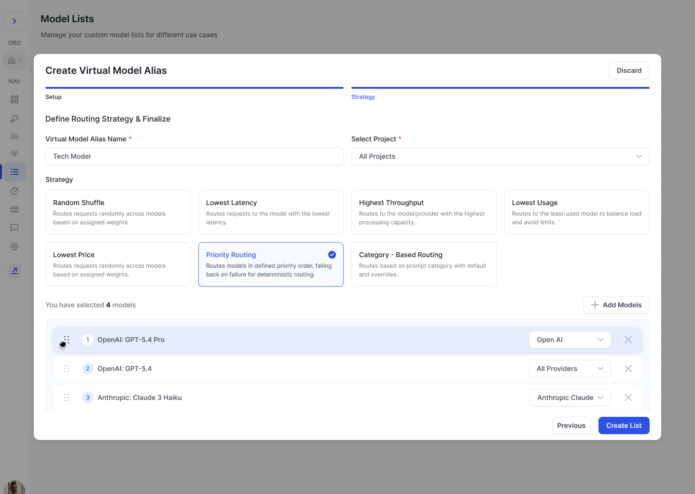
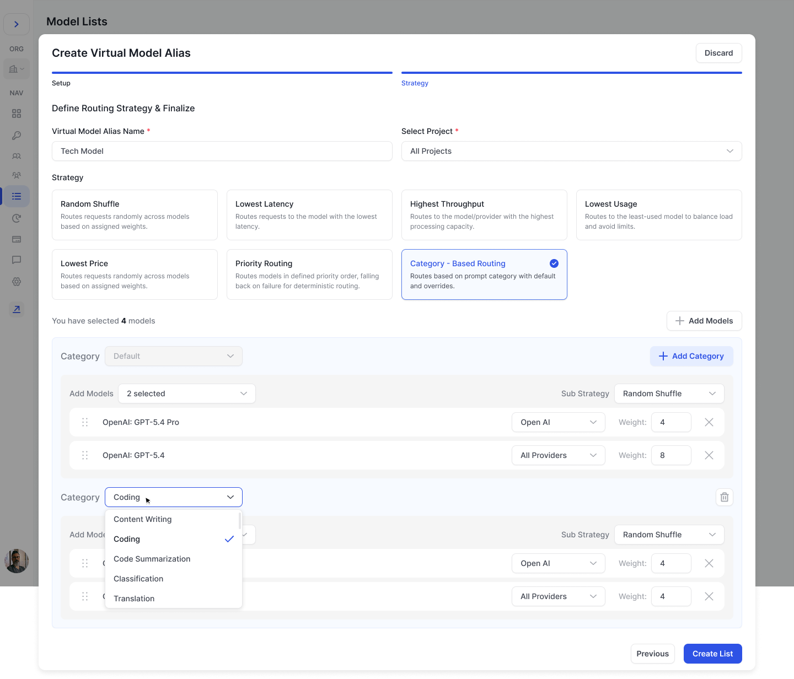

# Virtual Model Aliases

### Overview

Virtual Model Aliases in FastRouter.ai let you easily group several models and providers under a single alias. You can reference the alias in your API calls by passing the alias name to the `model` parameter. FastRouter will then automatically select and route requests to one of the configured models—according to the selection strategy you specify.

This feature maximizes flexibility, reliability, and efficiency when deploying LLMs across different providers or model versions.



***

### How It Works

You can create a Virtual Model Alias by selecting models and providers, assigning weights (if needed), and choosing an automatic selection strategy. On each request, FastRouter will pick from the configured options automatically—and fall back to another model in the list if the primary one fails.

**Use Cases:**

* **A/B testing:** Seamlessly test multiple models/providers.
* **Resilience:** Automatic fallback if a provider or deployment is unavailable.
* **Optimization:** Route requests for the best speed, price, or usage.
* **Task specialization:** Direct different prompt types to the models best suited for them.

***

#### Selection Strategies

When configuring your Virtual Model Alias, you can specify how FastRouter should select models for each request:

**Available Strategies:**

* **Random Shuffle**\
  Each request is sent to a randomly selected model in your list, according to the weights you assign. Useful for A/B tests or spreading traffic evenly.
* **Lowest Latency**\
  Automatically selects the model with the fastest current response time, ensuring minimum wait time for end-users.
* **Highest Throughput**\
  Picks the model/provider combination that can process requests at the highest rate, ideal for high-volume applications.
* **Lowest Usage**\
  Prioritizes models with the least usage, helping to balance load and prevent hitting usage or rate limits.
* **Lowest Price**\
  Routes requests to the least expensive model in the list, optimizing for cost savings.
* **Priority Routing**\
  Routes requests through models in a fixed, user-defined priority order. If the top-priority model or provider fails or is unavailable, FastRouter automatically falls back to the next model in sequence—providing deterministic, predictable routing.&#x20;

<figure><figcaption></figcaption></figure>

* **Category-Based Routing**\
  Routes each request to a model group based on the detected category of the prompt. You define a **Default** category (always present) and any number of named override categories (e.g., _Coding_, _Content Writing_, _Code Summarization_, _Classification_, _Translation_). Each category has its own model list, provider preferences, weights, and an independent **Sub Strategy** (e.g., Random Shuffle) that governs how models within that category are selected. If a request doesn't match any named category, it falls through to the Default category (which is always present and cannot be removed). This strategy is ideal when different task types are best handled by different models.

<figure><figcaption></figcaption></figure>

***

### **Built-in Automatic Fallback**

If a model/provider fails or is unavailable, FastRouter will transparently send the request to the next candidate in your list, according to your selected strategy—ensuring maximum reliability.

For **Priority Routing**, fallback follows the explicit numbered order you define.\
For **Category-Based Routing**, fallback within a category follows the configured Sub Strategy for that category.

***

### Getting Started

1. Go to the **Virtual Models** section in FastRouter.
2. Click on **Create Virtual Model Alias**.
3. In the **Select Models** screen, select one or more models to be referenced in your alias and click **Next**.

<figure><figcaption>
Select Models
</figcaption></figure>

4. In the **Finalize Details & Strategy** screen, enter a virtual model alias name.
5. Choose the **Projects** that have access to this alias and the **Strategy** for model selection.
6. **If using Random Shuffle, Lowest Latency, Highest Throughput, Lowest Usage, or Lowest Price:** Select the providers you want to include for each model and assign weights where applicable.
7. **If using Priority Routing:** Arrange models in your preferred fallback order by dragging them into sequence. Assign a provider for each model.
8. **If using Category-Based Routing:** Configure the Default category with models and a Sub Strategy, then add any named override categories as needed, each with their own models, providers, weights, and Sub Strategy.
9. Click **Create List**.

You can then reference this Virtual Model Alias in your API calls by specifying its name in the `model` parameter.

