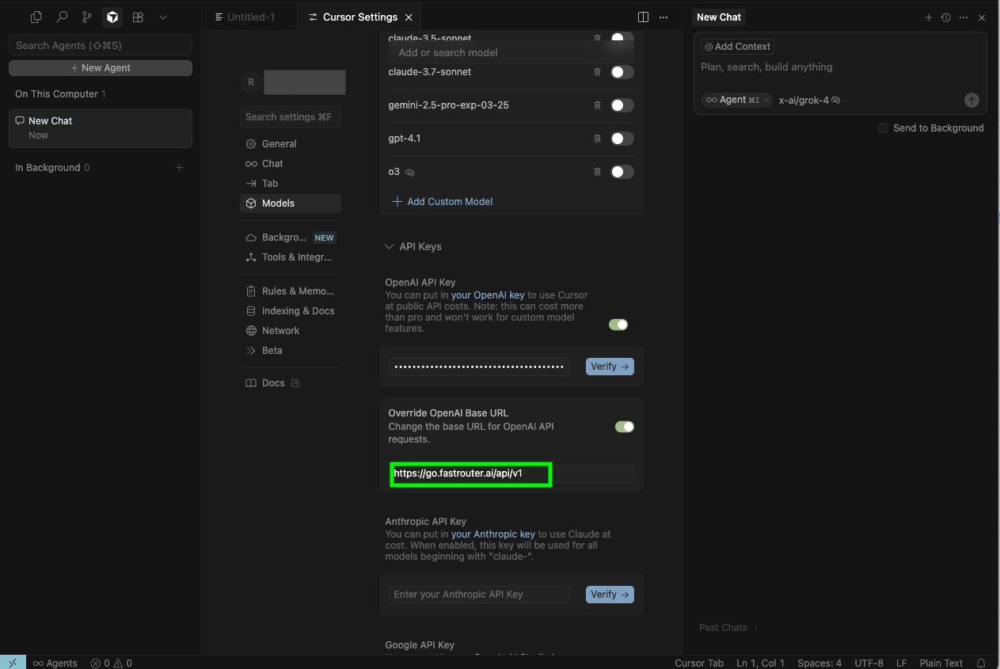
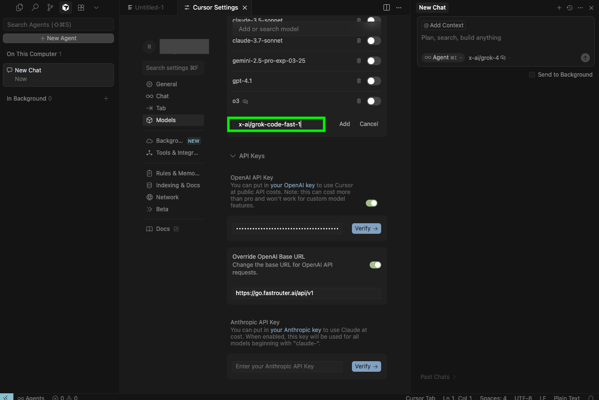
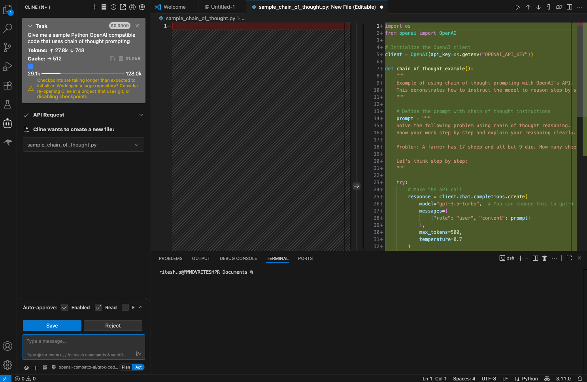
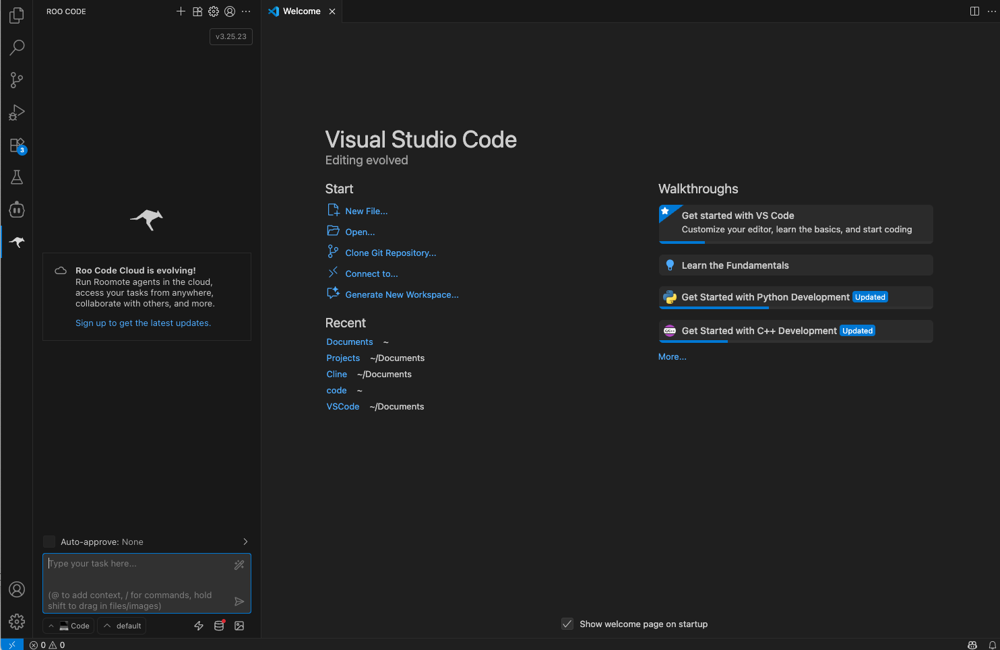
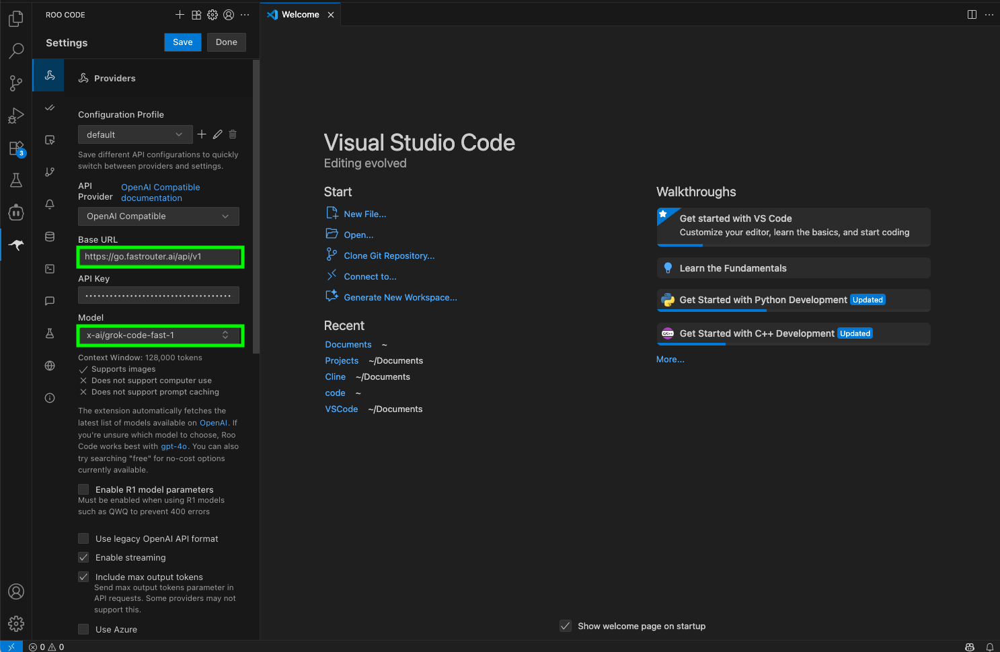

# IDE Integrations

FastRouter provides seamless integration with popular IDEs and code editors, allowing you to access advanced models like [Grok Code Fast 1](https://fastrouter.ai/models/x-ai/grok-code-fast-1) ( `x-ai/grok-code-fast-1`) through an OpenAI-compatible API. This enables features such as code completion, chat, and multimodal interactions directly within your development environment. Below, we outline step-by-step instructions for setting up FastRouter in Cursor, Cline, and Roo Code.

To get started, sign up at [https://FastRouter.ai ](https://fastrouter.ai/)and **Generate Your Free API key**.

<figure><figcaption></figcaption></figure>

***

While the instructions below focus on  `x-ai/grok-code-fast-1`, FastRouter supports a wide range of models. Check the [FastRouter Model Catalog ](https://fastrouter.ai/models)for options and input modalities (e.g., text, image, file) and follow the same instructions to add any other model of your choice.

### **Integrating with Cursor**

Cursor is a powerful AI-powered code editor. Follow these steps to configure it with FastRouter and use the latest models like  `x-ai/grok-code-fast-1`.

1. **Obtain Your API Key:** Sign up at [https://FastRouter.ai ](https://fastrouter.ai/)and generate your free API key.
2. **Configure Settings:** Open Cursor Settings and set the OpenAI Base URL to: `https://go.fastrouter.ai/api/v1`.
3. **Add the Model:** Click “Add Model” and enter: `x-ai/grok-code-fast-1`.&#x20;

<figure><figcaption></figcaption></figure> <figure><figcaption></figcaption></figure>

Once configured, you can leverage Grok Code Fast 1 for code generation, debugging, and more.

***

### **Integrating with Cline**

Cline is an efficient code assistant tool. Use the following steps to integrate FastRouter for access to the latest models like `x-ai/grok-code-fast-1`.

1. **Obtain Your API Key:** Sign up at [https://FastRouter.ai ](https://fastrouter.ai/)and generate your free API key.
2. **Configure Settings:** Navigate to Cline Settings, select API Provider: OpenAI Compatible, and set the Base URL to: `https://go.fastrouter.ai/api/v1`. Then, select or enter the Model ID: `x-ai/grok-code-fast-1`.

<figure><figcaption></figcaption></figure> <figure><figcaption></figcaption></figure> <figure><figcaption></figcaption></figure>

Your setup is complete, and Grok Code Fast 1 is ready for tasks such as code completion and analysis.

***

### **Integrating with Roo Code**

Roo Code offers robust coding support. Integrate FastRouter to enable the latest models like  `x-ai/grok-code-fast-1` with these steps.

1. **Obtain Your API Key:** Sign up at [https://FastRouter.ai ](https://fastrouter.ai/)to generate your free API key, which includes access to millions of tokens for Grok Code Fast 1 and other models.
2. **Configure Settings:** In Roo Code settings, choose API Provider: OpenAI Compatible. Set the Base URL to `https://go.fastrouter.ai/api/v1`. Paste in your API key, then enter the Model ID: `x-ai/grok-code-fast-1`.

<figure><figcaption></figcaption></figure> <figure><figcaption></figcaption></figure>

Grok Code Fast 1 is now integrated and available for use in your workflows.

***

#### **Tips & Best Practices**

* **API Key Security:** Store your FastRouter API key securely and avoid sharing it. If compromised, regenerate it from your account dashboard.
* **Troubleshooting:** Ensure your IDE is updated to the latest version. If you encounter issues, verify the Base URL and API key, or contact FastRouter support.

For more details on models or advanced configurations, explore the rest of the FastRouter documentation. If your IDE isn't listed, it may still be compatible—reach out to our team for assistance.
