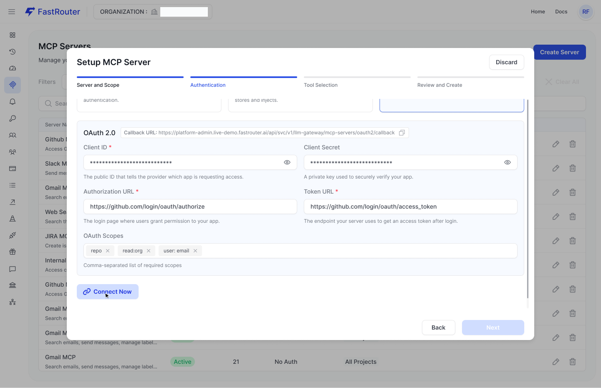
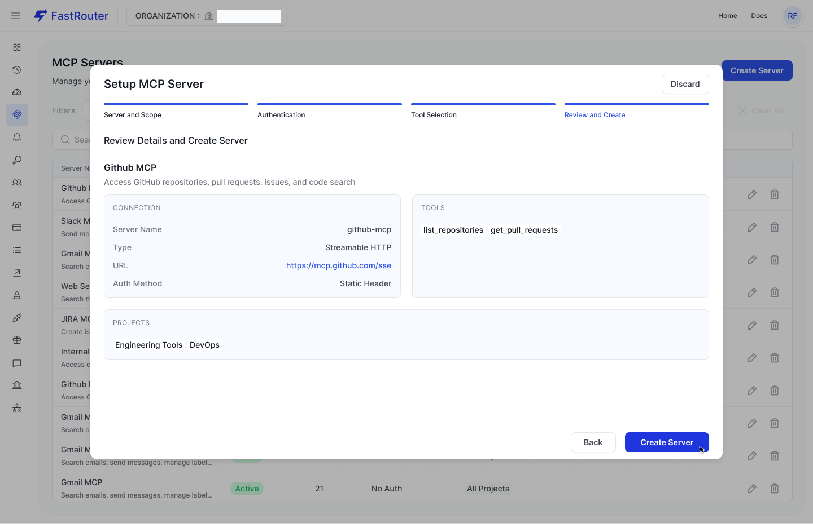

# MCP Gateway

### Overview

The MCP (Model Context Protocol) Gateway lets you register external tool servers — such as GitHub, Linear, DeepWiki, Intercom, or your own internal APIs — and make their capabilities available to any LLM call routed through FastRouter.

Rather than managing tool authentication and invocation logic in every client, you configure it once in FastRouter. The gateway handles credential injection, tool discovery, and auto-execution on behalf of your models.

FastRouter supports the **Streamable HTTP** transport defined in the MCP 2025-03-26 specification, as well as **SSE-based servers**.&#x20;

#### Key Capabilities

| Capability                            | Description                                                                                                                                |
| ------------------------------------- | ------------------------------------------------------------------------------------------------------------------------------------------ |
| **Centralized credential management** | Static headers and OAuth tokens are stored securely server-side. Models never receive raw credentials.                                     |
| **Selective tool exposure**           | Choose exactly which tools from a server are made available. Destructive operations (e.g. `delete_repository`) can be excluded entirely.   |
| **Project-level scoping**             | Restrict each MCP server to specific projects, or make it available across all projects in your organization.                              |
| **Auto-execution**                    | With `auto_execute_tools: true`, FastRouter handles the full tool-call loop, including multi-round execution up to a configurable maximum. |

***

### Setting Up an MCP Server

Add a new server from the **MCP Servers** page by clicking **Create Server**. The setup wizard walks through four steps.

#### Step 1 — Server and Scope

Define the connection details and which projects should have access to this server.

<figure><figcaption></figcaption></figure>

| Field         | Required | Description                                                                                              |
| ------------- | -------- | -------------------------------------------------------------------------------------------------------- |
| Server Type   | ✓        | Transport protocol. Streamable HTTP for remote servers using **HTTP POST + optional SSE**                |
| Server Name   | ✓        | Unique, lowercase slug used to reference this server in API calls (e.g. `github-production`). No spaces. |
| Display Name  | ✓        | Human-readable label shown in the dashboard (e.g. `Github Production`).                                  |
| Description   | —        | Optional summary of what this server provides.                                                           |
| Server URL    | ✓        | HTTP or SSE endpoint for the MCP server (e.g. `https://api.githubcopilot.com/mcp/`).                     |
| Project Scope | ✓        | One or more projects that can use this server, or **All Projects** for organization-wide access.         |

***

#### Step 2 — Authentication

Choose how FastRouter authenticates with the MCP server on each request. Three methods are supported.

1. **No Authentication**

No credentials are sent. Suitable for public or internally-trusted servers. Tools run without any credential injection.

<figure><figcaption></figcaption></figure>

2. **Static Header**

A fixed API key or bearer token injected into each outbound request header. FastRouter stores the value encrypted at rest.

<figure><figcaption></figcaption></figure>

| Field  | Required | Description                                                                               |
| ------ | -------- | ----------------------------------------------------------------------------------------- |
| Header | ✓        | Header name to use (e.g. `Authorization`, `x-api-key`).                                   |
| String | ✓        | The token value — stored encrypted, never exposed in responses (e.g. `Bearer sk_live_…`). |

3. **OAuth 2.0**

Full OAuth 2.0 authorization code flow with scoped permissions and token refresh. FastRouter acts as the OAuth client. A callback URL is provided — register it with your OAuth provider before proceeding.

<figure><figcaption></figcaption></figure>

| Field             | Required | Description                                                                                |
| ----------------- | -------- | ------------------------------------------------------------------------------------------ |
| Client ID         | ✓        | Public identifier issued by your OAuth provider.                                           |
| Client Secret     | ✓        | Private key used to verify your app. Stored encrypted.                                     |
| Authorization URL | ✓        | The provider's login/consent page (e.g. `https://github.com/login/oauth/authorize`).       |
| Token URL         | ✓        | The provider's access-token endpoint (e.g. `https://github.com/login/oauth/access_token`). |
| OAuth Scopes      | —        | Comma-separated list of permission scopes (e.g. `repo`, `read:org`, `user:email`).         |

After filling in OAuth fields, click **Connect Now** to complete the authorization flow before proceeding to the next step.

***

#### Step 3 — Tool Selection

FastRouter connects to the server and enumerates its available tools.&#x20;

<figure><figcaption></figcaption></figure>

Select which tools to expose to models.

* The **left panel** lists all tools available from the server.
* The **right panel** shows your current selection.
* Use the **search box** to filter large tool sets.
* **Select All** enables every tool at once; **Clear All** resets the selection.

***

#### Step 4 — Review and Create

Confirm all settings before creating the server.&#x20;

<figure><figcaption></figcaption></figure>

The review screen shows:

* **Connection** — server name, transport type, URL, and authentication method
* **Tools** — the enabled tool list
* **Projects** — which projects have access

Click **Create Server** to finalize.

***

### Managing Servers

All registered MCP servers are listed on the **MCP Servers** page. Each row shows status, tool count, authentication method, and project scope at a glance.

| Column                | Description                                                                                             |
| --------------------- | ------------------------------------------------------------------------------------------------------- |
| Server Name           | Display name and description.                                                                           |
| Status                | `Active` — server is reachable and tools are available. `Inactive` — server is unreachable or disabled. |
| Tools                 | Count of tools enabled on this server.                                                                  |
| Authentication Method | One of `No Auth`, `Static Headers`, `OAuth 2.0`                                                         |
| Projects              | Projects with access. `All Projects` means organization-wide.                                           |

Use the **+ Project**, **+ Status**, and **+ Authentication Method** filter chips to narrow the list. Click the pencil icon to edit a server or the trash icon to delete it.

***

### API Reference

MCP tool calling is controlled through the `mcp` object in your chat completions request body. All standard FastRouter routing parameters apply alongside MCP settings.

#### Endpoint

```
POST https://api.fastrouter.ai/api/v1/chat/completions
```

#### MCP Parameters

| Parameter                | Type      | Required     | Description                                                                                                                                                                                                 |
| ------------------------ | --------- | ------------ | ----------------------------------------------------------------------------------------------------------------------------------------------------------------------------------------------------------- |
| `mcp`                    | object    | —            | Top-level object that controls MCP behavior for this request.                                                                                                                                               |
| `mcp.enabled`            | boolean   | —            | Activates MCP for this request. Default: `false`.                                                                                                                                                           |
| `mcp.servers`            | string\[] | ✓ if enabled | List of server name slugs to make available to the model. Servers must belong to the active project and be in `Active` status.                                                                              |
| `mcp.auto_execute_tools` | boolean   | —            | When `true`, FastRouter automatically invokes tool calls, feeds results back, and continues until a final response is produced or `max_tool_rounds` is reached. Requires `stream: false`. Default: `false`. |
| `mcp.max_tool_rounds`    | integer   | —            | Maximum tool-call/response cycles when `auto_execute_tools` is enabled. Hard-capped at `5`. Default: `5`.                                                                                                   |

**Note:** `auto_execute_tools: true` requires `stream: false`. Non-streaming requests with auto-execution enabled will return a `tool_calls` response and stop — the caller is responsible for continuing the conversation.

***

### Examples

#### Basic request without auto execute

Attach a server to a request. When the model decides to use a tool, the response `finish_reason` is `tool_calls` and the message contains a populated `tool_calls` array. The caller is responsible for executing the tool and sending results back.

```bash
curl --location 'https://api.fastrouter.ai/api/v1/chat/completions' \
--header 'Authorization: Bearer <API-KEY>' \
--header 'Content-Type: application/json' \
--data '{
    "messages": [
        { "role": "system", "content": "You are a helpful assistant" },
        { "role": "user",   "content": "What transport protocols does the 2025-03-26 MCP spec support?" }
    ],
    "model": "openai/gpt-5.2",
    "stream": false,
    "mcp": {
        "enabled": true,
        "servers": ["deepwiki-mcp"],
        "auto_execute_tools": false
    }
}'
```

**Response — model returns a tool call:**

```json
{
    "choices": [{
        "finish_reason": "tool_calls",
        "message": {
            "role": "assistant",
            "content": "",
            "tool_calls": [{
                "id": "call_kebySk5LaUdfpAWkfqR7MHW2",
                "type": "function",
                "function": {
                    "name": "deepwiki-mcp__ask_question",
                    "arguments": "{\"repoName\":\"modelcontextprotocol/modelcontextprotocol\",\"question\":\"...\"}"
                }
            }]
        }
    }],
    "usage": {
        "prompt_tokens": 323,
        "completion_tokens": 63,
        "total_tokens": 386,
        "cost": 0.00144725
    }
}
```

***

#### Basic request with auto execution

Set `auto_execute_tools: true` with `stream: false` to let FastRouter complete the full tool loop and return a final text answer directly.

```json
{
    "messages": [
        { "role": "system", "content": "" },
        { "role": "user",   "content": "What transport protocols does the 2025-03-26 MCP spec support?" }
    ],
    "model": "openai/gpt-5.2",
    "stream": false,
    "mcp": {
        "enabled": true,
        "servers": ["deepwiki-mcp"],
        "auto_execute_tools": true,
        "max_tool_rounds": 2
    }
}
```

**Response — final text answer, no tool\_calls:**

```json
{
    "choices": [{
        "finish_reason": "stop",
        "message": {
            "role": "assistant",
            "content": "The 2025-03-26 MCP spec defines two primary transports:\n\n1. **STDIO** — uses the server process's standard input/output streams for local, spawned processes.\n2. **Streamable HTTP** — HTTP POST for client→server messages, with optional SSE for streaming server→client responses."
        }
    }],
    "usage": {
        "prompt_tokens": 2677,
        "completion_tokens": 405,
        "total_tokens": 3082,
        "cost": 0.01035475
    }
}
```

***

#### Multiple servers

Include multiple server slugs in the `servers` array. The model decides which tools from which servers to invoke based on the request.

```json
"mcp": {
    "enabled": true,
    "servers": ["github-production", "jira-mcp", "slack-mcp"],
    "auto_execute_tools": true,
    "max_tool_rounds": 3
}
```

***

### Usage Notes

#### Tool name format

Tool names in responses follow the format `{server-name}__{tool-name}` — for example, `deepwiki-mcp__ask_question`. This makes it easy to identify the originating server in traces and logs.

#### Token costs

Tool schemas and intermediate tool results are injected into the model's context window, increasing prompt token usage compared to standard chat completions. This is reflected in `usage.prompt_tokens` and `usage.cost` in each response.

#### Server name collisions

Server names must be unique within an organization. If you need the same MCP server registered under two different credential sets (e.g. read-only vs. read-write GitHub access), use distinct slugs such as `github-readonly` and `github-admin`.

#### Inactive servers

Referencing an `Inactive` server in an API call will return an error. Ensure the server is reachable and credentials are valid before using it in production.

MCP tool calls are captured in **Logs & Traces** with full span details, including tool name, arguments, and execution time. Use the trace viewer to debug multi-round tool executions.
