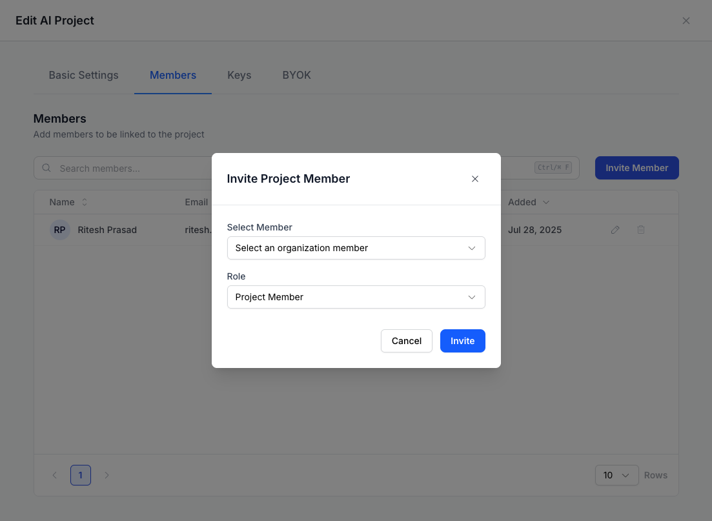

# Projects

### Projects Overview

Projects in FastRouter.ai provide a structure for organizing activity within your organization. Each project is independently configurable and managed, giving teams control over resources, permissions, and integrations.



You can manage the following aspects under **Projects** in FastRouter.ai:

***

### 1. Basic Settings

<figure><figcaption></figcaption></figure>

Configure fundamental parameters for your project, such as rate limits, budget controls, and accessible models.

**Fields include:**

* **Project Name**: Identify your project.
* **Models**: Select accessible model families.
* **Tokens Per Minute / Requests Per Minute**: Specify global usage limits for the project.
* **Budget Limit**: (Optional) Toggle to enforce a spending cap for the project.
* **Maximum Budget & Reset Duration**: Set and reset spending limits as desired.

Click **Save** once your configurations are complete.

***

### 2. Members

<figure><figcaption></figcaption></figure>

The **Members** tab lets you manage who can access your project and assign specific roles:

**Roles available:**

* **Project Admin**
  * Manage project settings, members, and API keys.
  * Full control over the project configuration including inviting other members.
* **Project Member**
  * Can create personal API keys based on permissions.

**Note:**\
Organization Owners are automatically **Project Admins** for all projects. Additional admins or members can be added from here as needed.

**To invite members:**

1. Click **Invite Member**.
2. Select the organization member and assign the appropriate role.
3. Click **Invite**.

***

### 3. Keys

<figure><figcaption></figcaption></figure>

API keys in FastRouter.ai allow secure access to model endpoints within a project.

* **Create User Key**: Generate API keys owned by a user to access all models routed by FastRouter.
* **Create Provisioning Key**: Generate provisioning keys that can in turn be used to create manage service account keys programatically.
* **Manage Existing Keys**: Edit or revoke as needed.

***

### Important:

* When a project is made **inactive**, all user keys associated with that project will be **disabled**.
* When a project member is **removed**, any user keys they have created for the project will also be **disabled**.

