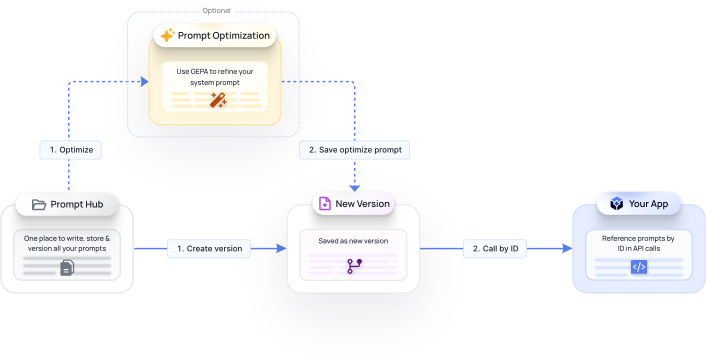

# Prompt Library

## Introduction

Prompt Library is the single place to write, store, version, test, and optimize your prompts before deploying them to production. Instead of hard-coding prompt strings into your application, you author them in FastRouter, manage them as versioned records, and reference them by ID in your API calls. When you ship a change, you publish a new version — no code deploy required.

This page covers what Prompt Library does, how it works, and how to call a stored prompt from the API.

### Why use it

Prompts change far more often than application code. Keeping them in Prompt Library gives you:

* **A versioned history** of every prompt, with notes on what changed in each version.
* **Safe rollouts** — mark exactly one version as _Production_ and have all live requests use it, then roll back instantly by promoting an older version.
* **Optional optimization** — refine a system prompt with GEPA and save the result as a new version, without overwriting your original.
* **Decoupled deployments** — update the prompt your app runs without redeploying the app, since requests reference the prompt by ID.

### How it works

The lifecycle is: author a prompt in the **Prompt Library**, optionally **optimize** it, save changes as a **new version**, then **reference it by ID** from your application.

<figure><figcaption><p>Prompt Library flow: Prompt Library → (optional) Prompt Optimization → New Version → Your App</p></figcaption></figure>

1. **Create version** — Write and store a prompt in the Prompt Library.
2. **Optimize** (optional) — Run GEPA to refine the system prompt.
3. **Save optimized prompt** — The refined prompt is saved as a new version.
4. **Call by ID** — Your application references the prompt by its ID in API calls.

### Creating a prompt

From **Prompts → Prompt Library**, click **Create Prompt** and fill in:

* **Prompt Name** — A human-readable name (e.g. `Health Assistant Prompt`).
* **Tags** — Up to five comma-separated tags for organization (e.g. `health`).
* **Prompt** — The system prompt text. Use `{{curly braces}}` to insert variables that you fill in at call time.
* **What changed in this version?** — A short changelog note (e.g. `Initial draft`). This is required and builds your version history.
* **Set as "Production"** — When checked, this version is used for all live requests that reference the prompt by ID.

<figure><figcaption><p>New Prompt form with name, tags, prompt body, version note, and Set as Production toggle</p></figcaption></figure>

Saving creates **v1** of the prompt and assigns a permanent prompt ID (e.g. `pmpt_3c743f7f9f9e467eae6525f00e6e0650`). The ID never changes across versions — it's the stable handle your application uses.

<figure><figcaption><p>Prompt Details showing v1 as the only version, marked Latest</p></figcaption></figure>

### Versioning

Each prompt keeps an ordered list of versions in the left panel of **Prompt Details**. Click **Add New** to create a new version, or generate one through optimization. Every version records its author, timestamp, and change note. The most recent version is tagged **Latest**; the version you promote is served as **Production**.

### Optimizing a prompt (optional)

Click **Optimize** on any prompt to run GEPA based [Prompt Optimizations](prompt-optimizations.md) against the current version. GEPA refines the system prompt and saves the result as a new version tagged **Optimized**, leaving your original untouched so you can compare or revert.

<figure><figcaption><p>Prompt Details showing v2 (Latest, Optimized) alongside v1, with the expanded optimized prompt text</p></figcaption></figure>

The optimized version is annotated with the optimizer job that produced it (e.g. `Optimized via optimizer job opt_094b50e343624dad99d127f4d57b28d7`), so you can trace any version back to its source. Use **Compare** to view the diff between two versions before promoting one to Production.

<figure><figcaption><p>Compare Prompt Versions showing the differences between two prompt versions</p></figcaption></figure>

### Calling a prompt by ID

Reference a stored prompt by passing its `prompt_id` to the chat completions endpoint. When you do this **without pinning a version, FastRouter serves the version currently marked Production** — so promoting a new Production version changes what your app runs, with no code change on your side.

The **API Usage** tab on the Prompt Details page generates a ready-to-run snippet for the selected prompt:

<figure><figcaption><p>API Usage tab that shows the configuration to be used in your requests</p></figcaption></figure>

```bash
curl -X POST "https://api.fastrouter.ai/api/v1/chat/completions" \
  -H "Content-Type: application/json" \
  -H "Authorization: Bearer API-KEY" \
  -d '{
    "model": "openai/gpt-4.1",
    "prompt_id": "pmpt_dde193a153a14fbf9829dd9499bf828b",
    "variables": {},
    "messages": [
      { "role": "user", "content": "hi" }
    ]
  }'
```

#### Request parameters

| Parameter   | Required | Description                                                                                                             |
| ----------- | -------- | ----------------------------------------------------------------------------------------------------------------------- |
| `model`     | Yes      | The model to route the request to (e.g. `openai/gpt-4.1`).                                                              |
| `prompt_id` | Yes      | The stored prompt's ID. Resolves to the **Production** version.                                                         |
| `variables` | No       | Key–value map filling any `{{variables}}` declared in the prompt. Defaults to `{}`.                                     |
| `messages`  | Yes      | The conversation turns. The stored prompt is applied as the system prompt; `messages` carries the user/assistant turns. |

#### Working with variables

If your prompt contains placeholders such as `{{patient_age}}` or `{{topic}}`, supply their values in `variables`:

```json
{
  "model": "openai/gpt-4.1",
  "prompt_id": "pmpt_dde193a153a14fbf9829dd9499bf828b",
  "variables": {
    "topic": "ibuprofen dosing"
  },
  "messages": [
    { "role": "user", "content": "Is this safe with my blood pressure medication?" }
  ]
}
```

FastRouter substitutes the values into the stored prompt before sending the request to the model. Detected variables for a prompt are listed at the bottom of the **Prompt** tab.

### Promoting and rolling back

To change what production traffic uses, open the target version and set it as **Production** (or check **Set as "Production"** when saving a new version). Because your application references the prompt only by `prompt_id`, the switch takes effect immediately for all live requests, and you can revert by promoting a previous version the same way.
